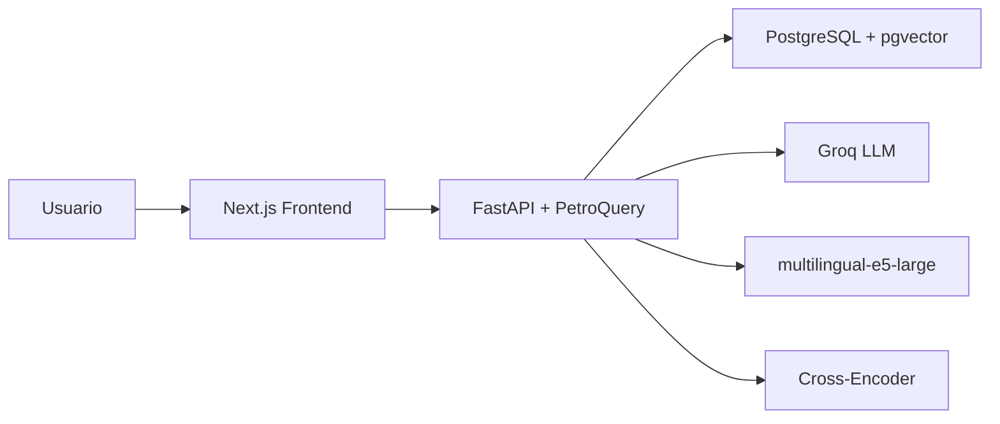

# PetroQuery — RAG Industrial para Oil & Gas

> Inteligencia técnica especializada para operaciones de misión crítica en Vaca Muerta, Argentina.

[](https://fastapi.tiangolo.com)
[](https://github.com/pgvector/pgvector)
[](https://www.python.org)

## Arquitectura



## Decisiones Técnicas

| Decisión | Justificación |
|---|---|
| Hybrid Search + RRF | Combina recuperación semántica + léxica para precisión en manuales técnicos |
| multilingual-e5-large | 1024d, optimizado para español técnico industrial |
| Instructor + Pydantic | Outputs estructurados validados, cero alucinaciones de formato |
| Async PDF Processing | Ingesta no-bloqueante para manuales densos de cientos de páginas |
| Chunking consciente de tablas | Preserva integridad de datos tabulares (presiones, especificaciones) |

## Benchmarks Objetivo

| Métrica | Target |
|---|---|
| Faithfulness | > 0.90 |
| Answer Accuracy | > 0.85 |
| Citation Precision | 1.00 |

## Quick Start

```bash
docker compose up -d
python scripts/init_petroquery_db.py
uvicorn app.main:app --reload
cd frontend && npm run dev
```

### Setup completo

```bash
# 1. Infraestructura (PostgreSQL + pgvector)
docker-compose up -d db

# 2. Entorno virtual
python -m venv venv
source venv/bin/activate
pip install -r requirements.txt

# 3. Variables de entorno
cp .env.example .env
# Editar .env con GROQ_API_KEY, DATABASE_URL, etc.

# 4. Inicializar base de datos
python scripts/init_petroquery_db.py

# 5. Levantar API
uvicorn app.main:app --reload --host 0.0.0.0 --port 8000
```

La documentación interactiva de la API está disponible en:
- **Swagger UI**: http://localhost:8000/docs
- **ReDoc**: http://localhost:8000/redoc

### Evaluación del sistema

```bash
export EVAL_USERNAME=evaluator
export EVAL_PASSWORD=evaluator123
python scripts/evaluate_petroquery.py
```

El script generará un reporte detallado en:
```
eval/results_YYYYMMDD_HHMMSS.json
```

## 📁 Estructura del Proyecto

```
petroquery/
├── app/
│   ├── api/v1/              # Routers (auth, chat, ingest, admin)
│   ├── models.py            # SQLAlchemy + pgvector (1024d)
│   ├── services/            # AI, hybrid_search, document_processor
│   ├── prompts/             # System prompts especializados O&G
│   └── schemas/             # Pydantic schemas (OGTechnicalAnswer)
├── eval/
│   └── og_eval_dataset.json # Dataset de evaluación técnica (25 preguntas)
├── scripts/
│   ├── evaluate_petroquery.py   # Script de evaluación completo
│   └── init_petroquery_db.py    # Inicialización de DB
├── docs/
│   ├── ARCHITECTURE.md      # Deep dive de arquitectura
│   └── OG_SPECIALIZATION.md # Adaptación de RAG genérico a O&G
├── docker-compose.yml
└── requirements.txt
```

## Roadmap

- [ ] **Multi-documento con citas cruzadas**: permitir que una respuesta cite múltiples manuales simultáneamente con ranking de relevancia.
- [ ] **Integración SCADA / Datos en tiempo real**: enriquecer respuestas con lecturas de pozo en vivo via OPC-UA o MQTT.
- [ ] **Modelos locales**: despliegue de Llama 3.3 70B vía vLLM para operaciones offline en campamentos sin conectividad.
- [ ] **Conformidad SOC 2 / ISO 27001**: endurecimiento de autenticación, auditoría de consultas y cifrado en tránsito/reposo.
- [ ] **Soporte multilingüe extendido**: portugués para operaciones en Pre-Sal brasileño.

## 🤝 Contribuciones & Contacto

PetroQuery es un proyecto de demostración técnica orientado a hiring managers e ingenieros de operaciones de **YPF**, **Tecpetrol**, **PAE** y el ecosistema de servicios de Vaca Muerta.

Para consultas técnicas o propuestas de colaboración, abrir un issue o contactar directamente.

## Licencia

Proyecto de demostración técnica. Uso bajo licencia MIT.
