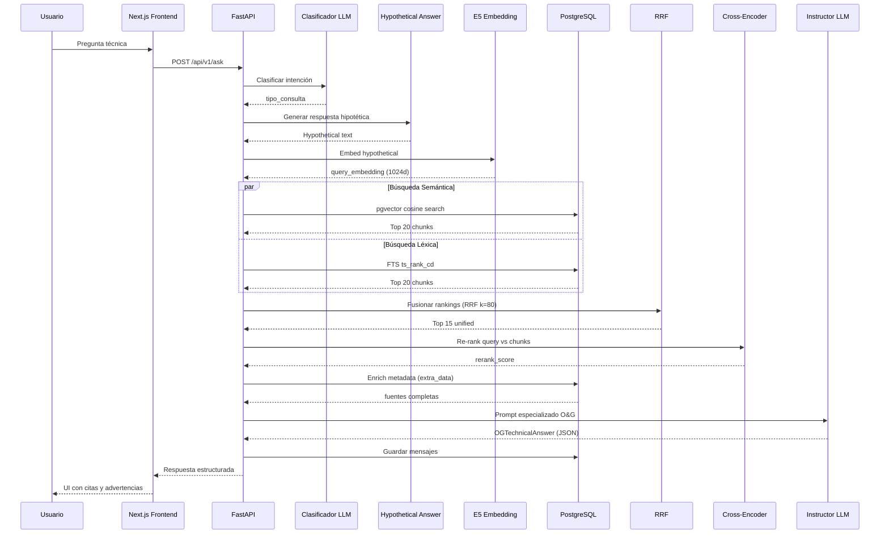

# Arquitectura Técnica de PetroQuery

> Documentación de arquitectura profunda para evaluadores técnicos y equipos de infraestructura.

---

## 1. Esquema de Base de Datos

### 1.1 PostgreSQL + pgvector

PetroQuery utiliza **PostgreSQL 16** con la extensión **pgvector** para almacenamiento y búsqueda vectorial de embeddings de 1024 dimensiones.

### 1.2 Tablas Principales

#### `users`
| Columna | Tipo | Descripción |
|---|---|---|
| `id` | `SERIAL PRIMARY KEY` | Identificador único |
| `email` | `VARCHAR(255) UNIQUE` | Correo electrónico |
| `username` | `VARCHAR(100) UNIQUE` | Nombre de usuario |
| `hashed_password` | `VARCHAR(255)` | Contraseña hasheada |
| `full_name` | `VARCHAR(255)` | Nombre completo |
| `role` | `VARCHAR(50)` | Rol (student, engineer, admin) |
| `is_active` | `BOOLEAN` | Usuario activo |
| `is_superuser` | `BOOLEAN` | Superusuario |
| `created_at` | `TIMESTAMPTZ` | Fecha de creación |

#### `documents`
| Columna | Tipo | Descripción |
|---|---|---|
| `id` | `SERIAL PRIMARY KEY` | Identificador único |
| `user_id` | `INTEGER FK → users.id` | Propietario del documento |
| `chat_id` | `INTEGER FK → chats.id` | Chat asociado (opcional) |
| `title` | `VARCHAR(255)` | Título del documento |
| `content` | `TEXT` | Contenido del chunk |
| `extra_data` | `JSONB` | Metadata estructurada (página, sección, tabla) |
| `embedding` | `VECTOR(1024)` | Embedding semántico del chunk |
| `created_at` | `TIMESTAMPTZ` | Fecha de ingesta |
| `cuenca` | `VARCHAR(100)` | Filtro: cuenca hidrocarburífera |
| `tipo_documento` | `VARCHAR(100)` | Filtro: manual, normativa, reporte |
| `tipo_equipo` | `VARCHAR(100)` | Filtro: BOP, Casing, ESP, etc. |
| `normativa_aplicable` | `VARCHAR(100)` | Filtro: IAPG-IRAM 301, API RP 53, etc. |
| `processing_status` | `VARCHAR(20)` | Estado de procesamiento async |
| `processing_progress` | `INTEGER` | Progreso de procesamiento (%) |

#### `chats`
| Columna | Tipo | Descripción |
|---|---|---|
| `id` | `SERIAL PRIMARY KEY` | Identificador único |
| `user_id` | `INTEGER FK → users.id` | Propietario |
| `title` | `VARCHAR(255)` | Título auto-generado de la conversación |
| `created_at` | `TIMESTAMPTZ` | Fecha de creación |

#### `messages`
| Columna | Tipo | Descripción |
|---|---|---|
| `id` | `SERIAL PRIMARY KEY` | Identificador único |
| `chat_id` | `INTEGER FK → chats.id` | Conversación asociada |
| `role` | `VARCHAR(20)` | user / assistant |
| `content` | `TEXT` | Texto plano del mensaje |
| `structured_response` | `JSONB` | Respuesta estructurada OGTechnicalAnswer |
| `created_at` | `TIMESTAMPTZ` | Fecha de creación |

### 1.3 Índices y Optimización

```sql
-- Índices B-tree para filtrado metadata
CREATE INDEX ix_documents_user_id ON documents(user_id);
CREATE INDEX ix_documents_chat_id ON documents(chat_id);
CREATE INDEX ix_documents_cuenca ON documents(cuenca);
CREATE INDEX ix_documents_tipo_documento ON documents(tipo_documento);
CREATE INDEX ix_documents_tipo_equipo ON documents(tipo_equipo);
CREATE INDEX ix_documents_normativa_aplicable ON documents(normativa_aplicable);

-- Índice compuesto para historial de mensajes
CREATE INDEX ix_messages_chat_id_created_at ON messages(chat_id, created_at);

-- Índice vectorial para búsqueda por similitud (IVFFlat)
CREATE INDEX ix_documents_embedding_ivfflat ON documents
USING ivfflat (embedding vector_cosine_ops)
WITH (lists = 100);
```

> **Nota:** El índice IVFFlat se construye con `lists = 100`, optimizado para ~10k-50k chunks técnicos. Para escalas mayores (>100k), se recomienda migrar a `ivfflat` con `lists = sqrt(n)` o `hnsw` para búsquedas exactas con mejor recall.

### 1.4 FTS (Full Text Search) en Español

```sql
-- Columna tsvector para búsqueda léxica
ALTER TABLE documents ADD COLUMN content_tsv tsvector
GENERATED ALWAYS AS (to_tsvector('spanish', coalesce(title, '') || ' ' || coalesce(content, ''))) STORED;

CREATE INDEX ix_documents_content_tsv ON documents USING GIN (content_tsv);
```

La búsqueda léxica utiliza el diccionario `spanish` de PostgreSQL, configurado para ignorar stopwords en español y realizar stemming básico.

---

## 2. Pipeline RAG

### 2.1 Flujo End-to-End

```
Usuario
  │
  ▼
[FastAPI Router /api/v1/ask]
  │
  ├──► Clasificador de Intención (Groq llama-3.1-8b)
  │      └── Determina tipo_consulta: operacional, normativa, seguridad, equipos, general
  │
  ├──► Generación de Respuesta Hipotética
  │      └── LLM genera una respuesta tentativa para mejorar el embedding de búsqueda
  │
  ├──► Embedding de Consulta
  │      └── multilingual-e5-large con prefijo "query:"
  │
  ├──► Hybrid Search
  │      ├── pgvector cosine similarity (k=20)
  │      └── PostgreSQL FTS (k=20)
  │
  ├──► Reciprocal Rank Fusion (RRF, k=80)
  │      └── score_rrf = Σ 1/(k + rank_i)
  │
  ├──► Re-ranking con Cross-Encoder
  │      └── ms-marco-MiniLM rerank sobre top 15 de RRF
  │
  ├──► Construcción de Prompt Especializado
  │      └── System prompt de Senior Field Engineer + contexto recuperado
  │
  └──► Generación Estructurada (Instructor)
         └── OGTechnicalAnswer validada por Pydantic
```

### 2.2 Generación Hipotética (Hypothetical Answer)

Antes de la búsqueda vectorial, el sistema genera una "respuesta hipotética" basada únicamente en la pregunta del usuario. Esta respuesta sintética se embebe en lugar de la pregunta cruda, mejorando la alineación semántica con chunks técnicos densos.

**Ventajas en O&G:**
- Una pregunta como "¿Qué presión soporta el BOP?" se expande a "El BOP Cameron U 13 5/8\" 10M soporta 10,000 psi de presión nominal..."
- El embedding de la respuesta hipotética se alinea mucho mejor con pasajes de manuales técnicos que el embedding de la pregunta sola.

### 2.3 Hybrid Search + RRF

**Búsqueda Semántica (pgvector):**
```sql
SELECT id, title, content, 1 - (embedding <=> query_embedding) AS vector_score
FROM documents
WHERE user_id = :user_id
ORDER BY embedding <=> :query_embedding
LIMIT 20;
```

**Búsqueda Léxica (FTS):**
```sql
SELECT id, title, content, ts_rank_cd(content_tsv, query) AS text_score
FROM documents
WHERE content_tsv @@ plainto_tsquery('spanish', :query)
ORDER BY text_score DESC
LIMIT 20;
```

**Fusión RRF:**
```python
rrf_score = sum(1.0 / (80 + rank) for rank in ranks)
```

La constante `k=80` fue elegida empíricamente para balancear entre la precisión de la búsqueda vectorial (generalmente mejor en top-5) y la cobertura de la búsqueda léxica (mejor en términos específicos de normativa).

### 2.4 Re-ranking con Cross-Encoder

Los top 15 resultados de RRF se pasan por un **Cross-Encoder** (`cross-encoder/ms-marco-MiniLM-L-6-v2`), que calcula una score de relevancia query-documento de mayor precisión que los embeddings bi-encoders.

**Por qué Cross-Encoder en lugar de solo embeddings:**
- Los bi-encoders (E5) codifican query y documento independientemente, perdiendo interacciones finas.
- El Cross-Encoder procesa `[CLS] query [SEP] document [SEP]` en un solo forward pass, capturando relaciones semánticas profundas.
- Costo computacional aceptable porque solo se evalúan 15 chunks, no toda la base.

### 2.5 Instructor + Pydantic Structured Output

La respuesta final se genera con **Instructor** (patrón de prompting con LLM + parsing estructurado) para garantizar que el modelo siempre devuelva un objeto JSON válido que cumpla con el schema `OGTechnicalAnswer`.

**Schema OGTechnicalAnswer:**
```python
class OGTechnicalAnswer(BaseModel):
    respuesta_tecnica: str                    # Markdown estructurado
    advertencia_seguridad: Optional[str]     # Solo si aplica riesgo operacional
    fuentes: list[SourceReference]           # Trazabilidad completa
    score_global_confianza: float            # [0.0, 1.0]
    necesita_revision_humana: bool           # True si < 0.7 o seguridad
    tipo_consulta: str                       # Clasificación de intención
```

**Validaciones de seguridad:**
- Si `tipo_consulta == "seguridad"`, `necesita_revision_humana` se fuerza a `True`.
- Si `score_global_confianza < 0.7`, se activa bandera de revisión humana.
- `fuentes` debe contener al menos una referencia cuando se recuperó contexto.

---

## 3. Por qué 1024 Dimensiones

La elección de **1024 dimensiones** para los embeddings no es arbitraria:

| Factor | Justificación |
|---|---|
| **Modelo E5-Large** | `multilingual-e5-large` produce vectores de 1024d. Es el sweet spot entre calidad y costo en español técnico. |
| **Capacidad de representación** | 1024 dimensiones capturan nuances semánticos en terminología bilingüe (español/inglés) común en manuales O&G. |
| **pgvector** | pgvector soporta eficientemente vectores de hasta 2000d. A 1024d, el índice IVFFlat mantiene tiempos de consulta <50ms con 50k chunks. |
| **Comparación con 384d/768d** | Modelos menores (MiniLM, BERT-base) pierden precisión en entidades técnicas compuestas (ej. "casing 13 3/8\" 10M H2S service"). |
| **Memoria** | 1024d × float32 = 4KB por chunk. Para 50k chunks = ~200MB de embeddings en RAM/disco, manejable en cualquier instancia PostgreSQL moderna. |

---

## 4. Estrategia de Filtrado por Metadata

### 4.1 Campos Indexados

Los campos de metadata se indexan como B-tree para permitir filtrado pre-vectorial:

- **`cuenca`**: "Vaca Muerta", "Neuquina", "Golfo San Jorge"
- **`tipo_documento`**: "manual", "normativa", "reporte", "especificacion"
- **`tipo_equipo`**: "BOP", "Christmas Tree", "Pumpjack", "Casing", "ESP"
- **`normativa_aplicable`**: "IAPG-IRAM 301", "API RP 53", "Res. SE 123/2018"

### 4.2 Flujo de Filtrado

```
Pregunta del usuario
  │
  ├──► Extracción de metadata implícita (LLM)
  │      └── Ej: "¿Qué dice IAPG sobre casing?" → normativa_aplicable="IAPG-IRAM 301", tipo_equipo="Casing"
  │
  └──► Aplicación de filtros WHERE en SQL
         └── WHERE normativa_aplicable = 'IAPG-IRAM 301' AND tipo_equipo = 'Casing'
```

### 4.3 Ventajas del Filtrado Híbrido

1. **Reducción de ruido**: Una consulta sobre "BOP" en Vaca Muerta no recupera documentos de BOPs del Golfo de México.
2. **Cumplimiento normativo**: Las consultas regulatorias se restringen a normativas vigentes en Argentina.
3. **Precisión de equipos**: Las especificaciones técnicas se filtran por modelo/fabricante evitando confusiones entre versiones.
4. **Performance**: El filtrado B-tree reduce el espacio de búsqueda vectorial antes de calcular similitudes de coseno.

### 4.4 Fallback sin filtros

Si el usuario no especifica metadata o el LLM no detecta filtros implícitos, la búsqueda se ejecuta sobre todo el corpus del usuario, manteniendo la cobertura máxima.

---

## 5. Diagrama de Secuencia



---

## 6. Consideraciones de Escalabilidad

| Escenario | Estrategia |
|---|---|
| **>100k chunks** | Migrar índice IVFFlat → HNSW con `m=16`, `ef_construction=64` |
| **Múltiples usuarios concurrentes** | Connection pooling con `asyncpg` + `pgbouncer` |
| **Manuales de >500 páginas** | Chunking jerárquico: sección → subsección → párrafo |
| **Multi-tenant** | Particionamiento por `user_id` o esquemas separados |
| **Disaster Recovery** | Replicación streaming PostgreSQL + backups diarios de embeddings |

---

*Documento generado para evaluación técnica de PetroQuery — Arquitectura de producción para operaciones Oil & Gas en Vaca Muerta.*
